# x402 Banana Playground

> AI-powered image generation platform with autonomous payments using MNEE stablecoin

An innovative platform that enables both humans and AI agents to generate images autonomously by paying with MNEE stablecoin on Ethereum. This project demonstrates programmable money in action, where AI agents can independently transact without human intervention.

## 🚀 Key Features

### For Human Users
- 🎨 AI image generation with optional input images
- 💳 Wallet-based authentication via Thirdweb
- 📊 Generation history with IndexedDB
- 🔄 Image editing and re-prompting
- 📱 Responsive modern UI

### For AI Agents (🌟 Main Innovation)
- 🤖 **RESTful API for autonomous agents**
- 💰 **MNEE stablecoin payments (0.15 MNEE per generation)**
- 🔐 **API key authentication system**
- ✅ **On-chain payment verification**
- 📈 **Usage tracking and analytics**
- 🛡️ **Security: Payment replay protection, wallet verification**

## 📊 System Architecture

```mermaid
graph TB
    subgraph "Users"
        Human[👤 Human User<br/>Web Interface]
        Agent[🤖 AI Agent<br/>API Integration]
    end
    
    subgraph "Ethereum Network"
        MNEE[💰 MNEE Contract<br/>0x8cce...A2bFD6cF]
        Treasury[🏦 Treasury Wallet<br/>0x74ce...185252a2]
    end
    
    subgraph "x402 Platform"
        WebUI[🌐 Next.js Web App<br/>Wallet Connection]
        AgentAPI[⚡ Agent API<br/>/api/agent/generate]
        Dashboard[📊 Agent Dashboard<br/>API Key Management]
        DB[(🗄️ Supabase<br/>API Keys & Payments)]
    end
    
    subgraph "AI Services"
        Gemini[🎨 Google Gemini<br/>Image Generation]
    end
    
    Human --> WebUI
    Agent --> AgentAPI
    Agent --> Dashboard
    
    WebUI --> MNEE
    AgentAPI --> MNEE
    MNEE --> Treasury
    
    AgentAPI --> DB
    Dashboard --> DB
    
    WebUI --> Gemini
    AgentAPI --> Gemini
    
    style MNEE fill:#4CAF50
    style Treasury fill:#2196F3
    style AgentAPI fill:#FF9800
    style Gemini fill:#9C27B0
```



## 💳 Human User Payment Flow

```mermaid
sequenceDiagram
    participant User as 👤 Human User
    participant Wallet as 🦊 MetaMask
    participant App as 🌐 Web App
    participant MNEE as 💰 MNEE Contract
    participant Treasury as 🏦 Treasury
    participant Gemini as 🎨 Gemini AI
    
    User->>App: 1. Enter prompt
    User->>App: 2. Click "Generate"
    App->>Wallet: 3. Request payment (0.15 MNEE)
    Wallet->>User: 4. Show approval dialog
    User->>Wallet: 5. Approve transaction
    Wallet->>MNEE: 6. Transfer 0.15 MNEE
    MNEE->>Treasury: 7. Send tokens to treasury
    MNEE-->>Wallet: 8. Transaction receipt
    Wallet-->>App: 9. Confirm payment
    App->>Gemini: 10. Request image generation
    Gemini-->>App: 11. Return generated image
    App->>User: 12. Display image + thinking
```



## 🤖 AI Agent Payment Flow

```mermaid
sequenceDiagram
    participant Agent as 🤖 AI Agent
    participant Dashboard as 📊 Dashboard
    participant MNEE as 💰 MNEE Contract
    participant Treasury as 🏦 Treasury
    participant API as ⚡ Agent API
    participant DB as 🗄️ Database
    participant Gemini as 🎨 Gemini AI
    
    Note over Agent,Dashboard: Setup Phase
    Agent->>Dashboard: 1. Connect wallet
    Dashboard->>Agent: 2. Generate API key
    Agent->>Agent: 3. Store API key
    
    Note over Agent,Gemini: Payment & Generation
    Agent->>MNEE: 4. Transfer 0.15 MNEE to treasury
    MNEE->>Treasury: 5. Send tokens
    MNEE-->>Agent: 6. Return tx hash
    
    Agent->>API: 7. POST /api/agent/generate<br/>{prompt, tx_hash, wallet, API_key}
    API->>DB: 8. Validate API key
    DB-->>API: 9. Key valid
    API->>MNEE: 10. Verify transaction on-chain
    MNEE-->>API: 11. Payment confirmed
    API->>DB: 12. Log payment
    API->>Gemini: 13. Generate image
    Gemini-->>API: 14. Return image
    API->>DB: 15. Mark as generated
    API-->>Agent: 16. Return image + metadata
```



## 🔐 API Key Management Flow


## ✅ Payment Verification Process

```mermaid
flowchart TD
    Start[🤖 Agent Calls API] --> Check1{Has API Key?}
    Check1 -->|No| Reject1[❌ 401 Unauthorized]
    Check1 -->|Yes| Check2{API Key Valid?}
    Check2 -->|No| Reject2[❌ 401 Invalid Key]
    Check2 -->|Yes| Check3{Has tx_hash?}
    Check3 -->|No| Reject3[❌ 400 Missing tx_hash]
    Check3 -->|Yes| Check4{Wallet Matches?}
    Check4 -->|No| Reject4[❌ 403 Wallet Mismatch]
    Check4 -->|Yes| Verify[🔍 Verify on Ethereum]
    Verify --> Check5{TX Valid?}
    Check5 -->|No| Reject5[❌ 400 Invalid Payment]
    Check5 -->|Yes| Check6{Amount = 0.15 MNEE?}
    Check6 -->|No| Reject6[❌ 400 Wrong Amount]
    Check6 -->|Yes| Check7{To Treasury?}
    Check7 -->|No| Reject7[❌ 400 Wrong Recipient]
    Check7 -->|Yes| Check8{Already Used?}
    Check8 -->|Yes| Reject8[❌ 400 TX Already Used]
    Check8 -->|No| Check9{Recent < 5min?}
    Check9 -->|No| Reject9[❌ 400 TX Too Old]
    Check9 -->|Yes| Success[✅ Generate Image]
    Success --> Return[📦 Return Result]
    
    style Start fill:#2196F3
    style Success fill:#4CAF50
    style Return fill:#4CAF50
    style Reject1 fill:#f44336
    style Reject2 fill:#f44336
    style Reject3 fill:#f44336
    style Reject4 fill:#f44336
    style Reject5 fill:#f44336
    style Reject6 fill:#f44336
    style Reject7 fill:#f44336
    style Reject8 fill:#f44336
    style Reject9 fill:#f44336
```



## 🛠️ Tech Stack

- **Frontend**: Next.js 14, React 19, TailwindCSS, shadcn/ui
- **Backend**: Next.js API Routes
- **Blockchain**: viem, Thirdweb
- **Database**: Supabase (PostgreSQL)
- **AI**: Google Gemini
- **Package Manager**: Bun

## 📦 Installation & Setup

### Prerequisites
- Node.js 18+ or Bun
- Supabase account
- Ethereum wallet with Sepolia testnet access
- MNEE tokens on Sepolia

### Quick Start

```bash
# Clone repository
git clone https://github.com/fozagtx/x402-banana.git
cd payments

# Install dependencies
bun install

# Copy environment variables
cp .env.example .env.local

# Update .env.local with your values:
# - NEXT_PUBLIC_SUPABASE_URL
# - NEXT_PUBLIC_SUPABASE_ANON_KEY
# - NEXT_PUBLIC_TREASURY_ADDRESS
# - GEMINI_API_KEY

# Run database migrations
# Apply migrations in supabase/migrations/ to your Supabase project

# Start development server
bun dev
```

Visit:
- Main app: `http://localhost:3000`
- Agent dashboard: `http://localhost:3000/agent/dashboard`
- API docs: `http://localhost:3000/agent/docs`

## 🤖 Agent Integration Example

```typescript
import { createWalletClient, http, parseUnits } from 'viem'
import { sepolia } from 'viem/chains'
import { privateKeyToAccount } from 'viem/accounts'

const MNEE_ADDRESS = '0x8ccedbAe4916b79da7F3F612EfB2EB93A2bFD6cF'
const TREASURY = process.env.TREASURY_ADDRESS
const API_KEY = process.env.AGENT_API_KEY

async function generateImage(prompt: string) {
  // 1. Setup wallet
  const account = privateKeyToAccount(process.env.PRIVATE_KEY)
  const client = createWalletClient({
    account,
    chain: sepolia,
    transport: http()
  })

  // 2. Pay 0.15 MNEE
  const hash = await client.writeContract({
    address: MNEE_ADDRESS,
    abi: [{
      name: 'transfer',
      type: 'function',
      inputs: [
        { name: 'to', type: 'address' },
        { name: 'amount', type: 'uint256' }
      ],
      outputs: [{ type: 'bool' }]
    }],
    functionName: 'transfer',
    args: [TREASURY, parseUnits('0.15', 6)] // MNEE has 6 decimals
  })

  // 3. Call API with payment proof
  const response = await fetch('https://yourapp.com/api/agent/generate', {
    method: 'POST',
    headers: {
      'Authorization': `Bearer ${API_KEY}`,
      'Content-Type': 'application/json'
    },
    body: JSON.stringify({
      prompt: prompt,
      payment_tx_hash: hash,
      wallet_address: account.address
    })
  })

  const result = await response.json()
  return result.image.data // Base64 encoded image
}

// Usage
const image = await generateImage('A banana on a skateboard')
```

## 🔒 Security Features

1. **Payment Verification**
   - On-chain transaction validation
   - Amount verification (exactly 0.15 MNEE)
   - Recipient verification (must be treasury)
   - Timestamp validation (< 5 minutes old)

2. **Anti-Replay Protection**
   - Each transaction hash can only be used once
   - Database tracking of used transactions

3. **Wallet Verification**
   - API key must match payment wallet
   - Prevents unauthorized usage

4. **Rate Limiting**
   - Per-API-key request limits
   - Usage tracking and analytics

## 📊 Database Schema

### agent_api_keys
```sql
CREATE TABLE agent_api_keys (
  id UUID PRIMARY KEY DEFAULT uuid_generate_v4(),
  api_key TEXT UNIQUE NOT NULL,
  wallet_address TEXT NOT NULL,
  name TEXT,
  created_at TIMESTAMP DEFAULT NOW(),
  usage_count INTEGER DEFAULT 0,
  last_used TIMESTAMP,
  is_active BOOLEAN DEFAULT true
);
```

### agent_payments
```sql
CREATE TABLE agent_payments (
  id UUID PRIMARY KEY DEFAULT uuid_generate_v4(),
  api_key_id UUID REFERENCES agent_api_keys(id),
  wallet_address TEXT NOT NULL,
  tx_hash TEXT UNIQUE NOT NULL,
  amount_mnee TEXT NOT NULL,
  prompt TEXT NOT NULL,
  created_at TIMESTAMP DEFAULT NOW(),
  image_generated BOOLEAN DEFAULT false
);
```

## 📚 API Documentation

### Generate Image Endpoint

**Endpoint**: `POST /api/agent/generate`

**Headers**:
```
Authorization: Bearer mnee_agent_YOUR_KEY
Content-Type: application/json
```

**Request Body**:
```json
{
  "prompt": "Your image prompt",
  "payment_tx_hash": "0x123...",
  "wallet_address": "0xABC..."
}
```

**Success Response** (200):
```json
{
  "success": true,
  "image": {
    "data": "base64_image_data",
    "mimeType": "image/png"
  },
  "thinking": ["reasoning step 1", "step 2"],
  "transaction": {
    "hash": "0x123...",
    "amount": "0.15"
  }
}
```

**Error Responses**:
- `401 Unauthorized`: Invalid or missing API key
- `400 Bad Request`: Invalid payment or missing parameters
- `403 Forbidden`: Wallet mismatch
- `500 Internal Server Error`: Generation failed

## 🌐 Smart Contract Details

- **MNEE Token Address**: `0x8ccedbAe4916b79da7F3F612EfB2EB93A2bFD6cF`
- **Network**: Ethereum Sepolia Testnet
- **Token Decimals**: 6
- **Payment Amount**: 0.15 MNEE per generation

## 🔮 Future Enhancements

- [ ] Support for multiple stablecoins (USDC, USDT)
- [ ] Bulk generation discounts for agents
- [ ] Webhook notifications for completed generations
- [ ] GraphQL API for advanced queries
- [ ] Multi-chain support (Polygon, Arbitrum)
- [ ] Agent marketplace for generated images

## 📄 License

MIT License

## 🙏 Acknowledgments

- MNEE Team for the stablecoin infrastructure
- Thirdweb for wallet integration
- Google Gemini for AI image generation
- Supabase for database services

## 📧 Contact

- **GitHub**: https://github.com/fozagtx/x402-banana
- **Project**: x402 Banana Playground

---

**Built for MNEE Hackathon 2025** 🍌 🚀